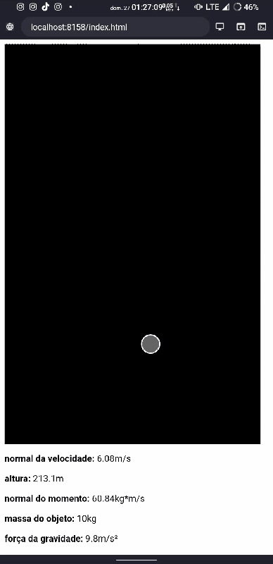

# gravity_move
Simulation in p5js of forces in any objects

<br>

um pequeno teste brincadeira com a biblioteca [p5js](https://p5js.org/)

<br>

<hr>

gravity move - v 0.0.1 
<br> -apenas uma bola com 10 quilos sofrendo ação do vento e da gravidade.
<br> o codigo do ```app.js```, se encontra [aqui](app.js)

<br>

